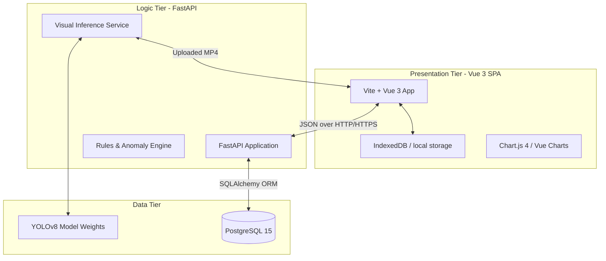
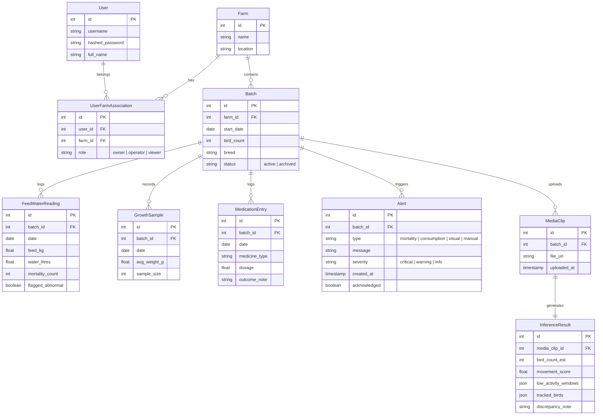
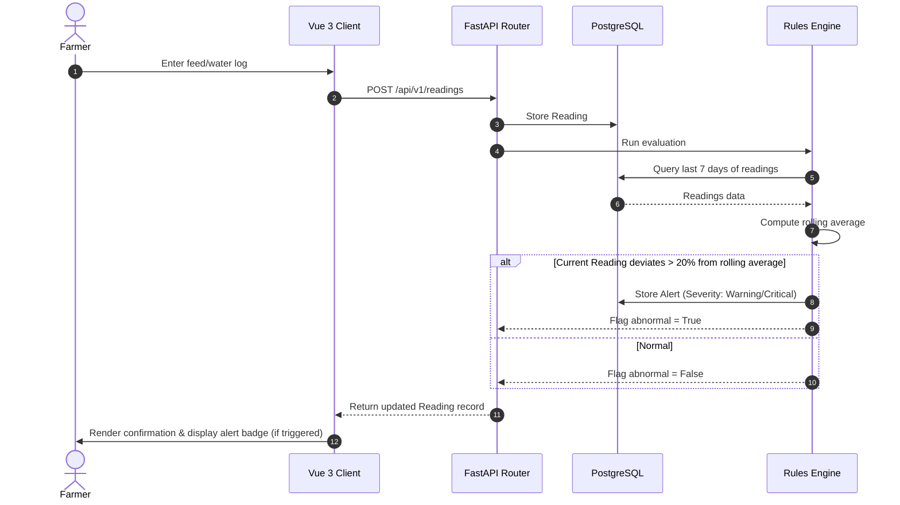
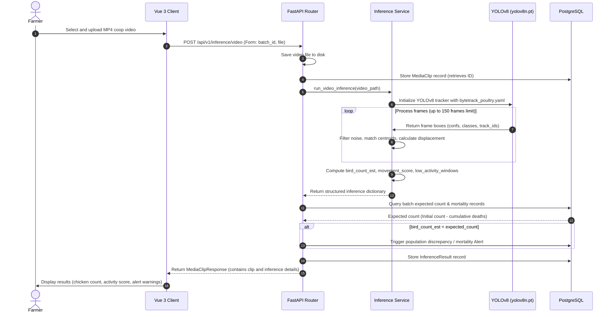
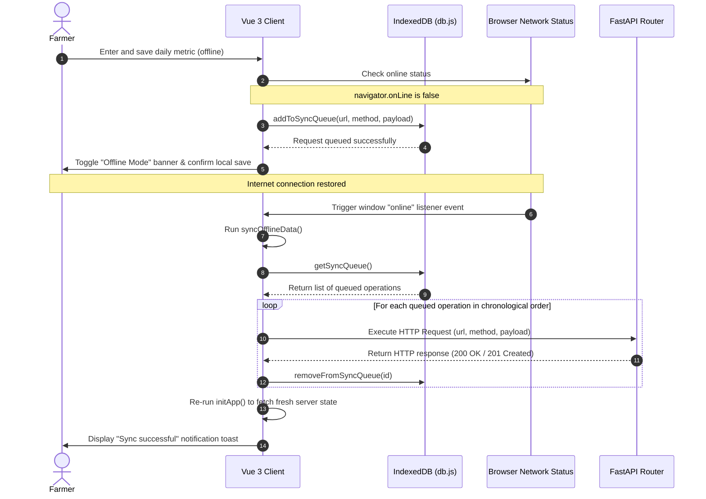

# 🏗️ AgriSense AI Architecture

AgriSense AI uses a classic, decoupled three-tier architecture designed to run efficiently on low-cost hardware in low-connectivity poultry environments. This document details the components, database structures, system flows, and our custom AI visual monitoring implementation.

---

## 1. System Topology

---

## 2. Component Directory Structure

The repository is divided into two primary subdirectories:

*   **`frontend/`** (Presentation Tier):
    *   **`src/views/`**: Page components (`Dashboard.vue`, `FeedWater.vue`, `AIVisualMonitor.vue`, etc.)
    *   **`src/components/`**: Reusable custom UI components (`Toast.vue`, `AgriProgressBar.vue`, etc.)
    *   **`src/services/`**: API wrapper clients and the IndexedDB local offline cache handlers.
*   **`backend/`** (Logic Tier & Database):
    *   **`app/routers/`**: REST API endpoints for farms, batches, daily logs, growth curves, and video uploads.
    *   **`app/models/`**: Declarative SQLAlchemy models.
    *   **`app/schemas/`**: Pydantic serialization and validation schemas.
    *   **`app/services/`**: Business logic modules (alert engines, custom trackers).

---

## 3. Database Entity Relationship Model

The relational database structure supports multi-farm scaling and role-based access controls (RBAC) linked to users:

---

## 4. Key System Flows

### 4.1 Daily Consumption Log & Alert Engine
When a farmer logs daily feed/water metrics, the rule-based anomaly engine computes rolling statistics to identify anomalies:

---

### 4.2 AI Video Monitoring Pipeline
To assess the health and population of a chicken flock, pre-recorded video clips are analyzed:

### 4.3 Offline Caching & Background Synchronization Flow
To support low-connectivity coop environments, the client application caches GET data and queues POST/PUT requests using browser IndexedDB storage:

---

## 5. Optimized AI Visual Monitoring Implementation

The core AI visual monitoring system uses a pretrained `yolov8n.pt` detector. To adapt it to dusty, crowded poultry coops without costly custom training, we decoupled the detection wrapper and tuned tracking parameters:

### 5.1 Custom ByteTrack Settings (`bytetrack_poultry.yaml`)
To prevent low-confidence detections from being discarded and improve tracking overlap, we configure:
*   **`track_high_thresh: 0.12`**: Lowers the match confidence required for primary detection association.
*   **`track_low_thresh: 0.05`**: Keeps track of highly occluded or dim background chickens.
*   **`new_track_thresh: 0.15`**: Sets the minimum threshold for starting a new track.
*   **`track_buffer: 60`**: Keeps lost tracks active for 60 frames (2 seconds at 30 FPS) to bridge periods when chickens block one another.
*   **`match_thresh: 0.7`**: Sets IoU matching overlap parameters.

### 5.2 Dynamic Noise Filtering & Post-Processing
*   **Centroid Lookup Lookup Bounds**: The fallback centroid tracker is restricted to look back at most 15 frames. This ensures that new chickens appearing do not inherit the IDs of long-disappeared chickens.
*   **Track Length Filtering**: Detections are divided into *transient tracks* (active for < 10 frames) and *stable tracks* (active for $\ge$ 10 frames). Transient tracks are treated as model detection noise (e.g. dust, feeders, brief mismatches) and are ignored in flock count calculations.
*   **Filtered Activity Index (Movement Score)**: Movement speeds are computed strictly on stable tracks. Frame-to-frame coordinate jitters under `1.5` pixels are treated as `0.0` (static) to prevent detection jitter from inflating the score, while jumps over `50.0` pixels are capped to prevent tracking swaps from causing score spikes.
